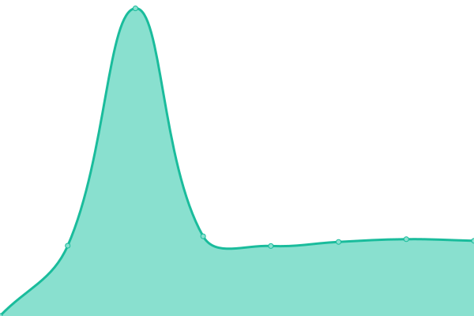
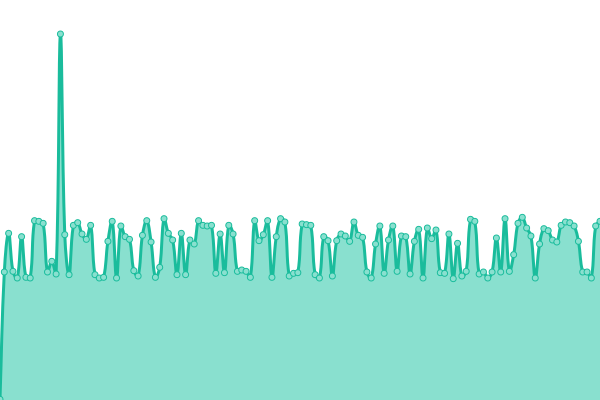

# [📈 Live Status](https://status.reinhart1010.id): <!--live status--> **🟧 Partial outage**

This repository contains the open-source uptime monitor and status page for [Upptime](https://upptime.js.org), powered by [Upptime](https://github.com/upptime/upptime).

With [Upptime](https://upptime.js.org), you can get your own unlimited and free uptime monitor and status page, powered entirely by a GitHub repository. We use [Issues](https://github.com/upptime/upptime/issues) as incident reports, [Actions](https://github.com/alterine0101/roothouse-status/actions) as uptime monitors, and [Pages](https://status.reinhart1010.id) for the status page.

<!--start: status pages-->
<!-- This summary is generated by Upptime (https://github.com/upptime/upptime) -->
<!-- Do not edit this manually, your changes will be overwritten -->
<!-- prettier-ignore -->
| URL | Status | History | Response Time | Uptime |
| --- | ------ | ------- | ------------- | ------ |
|  [Homepage (reinhart1010.id)](https://reinhart1010.id) | 🟩 Up | [homepage-reinhart1010-id.yml](https://github.com/alterine0101/roothouse-status/commits/HEAD/history/homepage-reinhart1010-id.yml) | 

 1649ms
     
 | 

<a href="https://status.reinhart1010.id/history/homepage-reinhart1010-id">100.00%</a>
    

|  [BINUSToday](https://binustoday.reinhart1010.id) | 🟩 Up | [binus-today.yml](https://github.com/alterine0101/roothouse-status/commits/HEAD/history/binus-today.yml) | 

 1020ms
     
 | 

<a href="https://status.reinhart1010.id/history/binus-today">100.00%</a>
    

|  [BINUSMAYA Down](https://binusmayadown.reinhart1010.id) | 🟩 Up | [binusmaya-down.yml](https://github.com/alterine0101/roothouse-status/commits/HEAD/history/binusmaya-down.yml) | 

 173ms
     
 | 

<a href="https://status.reinhart1010.id/history/binusmaya-down">100.00%</a>
    

|  [Food Navigator](https://reinhart1010.github.io/foodnavigator) | 🟩 Up | [food-navigator.yml](https://github.com/alterine0101/roothouse-status/commits/HEAD/history/food-navigator.yml) | 

 96ms
     
 | 

<a href="https://status.reinhart1010.id/history/food-navigator">100.00%</a>
    

|  [HAM Homepage](https://ham.reinhart1010.id) | 🟩 Up | [ham-homepage.yml](https://github.com/alterine0101/roothouse-status/commits/HEAD/history/ham-homepage.yml) | 

 143ms
     
 | 

<a href="https://status.reinhart1010.id/history/ham-homepage">100.00%</a>
    

|  [Nix](https://nix.reinhart1010.id) | 🟩 Up | [nix.yml](https://github.com/alterine0101/roothouse-status/commits/HEAD/history/nix.yml) | 

 142ms
     
 | 

<a href="https://status.reinhart1010.id/history/nix">100.00%</a>
    

|  [roothouse-0](https://rhstatus-proxy.alterine0101.id/?deviceId=roothouse-0) | 🟥 Down | [roothouse-0.yml](https://github.com/alterine0101/roothouse-status/commits/HEAD/history/roothouse-0.yml) | 

 2276ms
     
 | 

<a href="https://status.reinhart1010.id/history/roothouse-0">0.00%</a>
    

|  [roothouse-1](https://rhstatus-proxy.alterine0101.id/?deviceId=roothouse-1) | 🟥 Down | [roothouse-1.yml](https://github.com/alterine0101/roothouse-status/commits/HEAD/history/roothouse-1.yml) | 

 209ms
     
 | 

<a href="https://status.reinhart1010.id/history/roothouse-1">0.00%</a>
    

|  [roothouse-2](https://rhstatus-proxy.alterine0101.id/?deviceId=roothouse-2) | 🟥 Down | [roothouse-2.yml](https://github.com/alterine0101/roothouse-status/commits/HEAD/history/roothouse-2.yml) | 

 209ms
     
 | 

<a href="https://status.reinhart1010.id/history/roothouse-2">0.00%</a>
    

|  [roothouse-3](https://rhstatus-proxy.alterine0101.id/?deviceId=roothouse-3) | 🟥 Down | [roothouse-3.yml](https://github.com/alterine0101/roothouse-status/commits/HEAD/history/roothouse-3.yml) | 

 209ms
     
 | 

<a href="https://status.reinhart1010.id/history/roothouse-3">0.00%</a>
    

<!--end: status pages-->

[**Visit our status website →**](https://status.reinhart1010.id)

## 📄 License

- Powered by: [Upptime](https://github.com/upptime/upptime)
- Code: [MIT](./LICENSE) © [Upptime](https://upptime.js.org)
- Data in the `./history` directory: [Open Database License](https://opendatacommons.org/licenses/odbl/1-0/)
