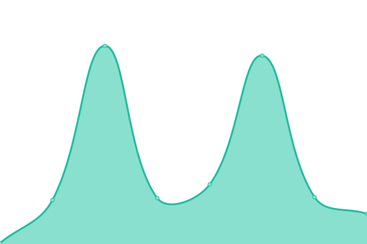

# [📈 Live Status](https://status.reinhart1010.id): <!--live status--> **🟧 Partial outage**

This repository contains the open-source uptime monitor and status page for [Upptime](https://upptime.js.org), powered by [Upptime](https://github.com/upptime/upptime).

With [Upptime](https://upptime.js.org), you can get your own unlimited and free uptime monitor and status page, powered entirely by a GitHub repository. We use [Issues](https://github.com/upptime/upptime/issues) as incident reports, [Actions](https://github.com/alterine0101/roothouse-status/actions) as uptime monitors, and [Pages](https://status.reinhart1010.id) for the status page.

<!--start: status pages-->
<!-- This summary is generated by Upptime (https://github.com/upptime/upptime) -->
<!-- Do not edit this manually, your changes will be overwritten -->
<!-- prettier-ignore -->
| URL | Status | History | Response Time | Uptime |
| --- | ------ | ------- | ------------- | ------ |
|  [Homepage (reinhart1010.id)](https://reinhart1010.id) | 🟩 Up | [homepage-reinhart1010-id.yml](https://github.com/alterine0101/roothouse-status/commits/HEAD/history/homepage-reinhart1010-id.yml) | 

 1154ms
     
 | 

<a href="https://status.reinhart1010.id/history/homepage-reinhart1010-id">99.86%</a>
    

|  [AEP Mobile Beta Announcements](https://aep-mobile-beta.reinhart1010.id) | 🟩 Up | [aep-mobile-beta-announcements.yml](https://github.com/alterine0101/roothouse-status/commits/HEAD/history/aep-mobile-beta-announcements.yml) | 

 169ms
     
 | 

<a href="https://status.reinhart1010.id/history/aep-mobile-beta-announcements">100.00%</a>
    

|  [AEP Mobile Staging Server](https://aep.alterine0101.id/api/get_countries?language=id) | 🟥 Down | [aep-mobile-staging-server.yml](https://github.com/alterine0101/roothouse-status/commits/HEAD/history/aep-mobile-staging-server.yml) | 

 840ms
     
 | 

<a href="https://status.reinhart1010.id/history/aep-mobile-staging-server">0.00%</a>
    

|  [AEP Mobile User Documentation](https://aep-userdocs.reinhart1010.id/index-en.html) | 🟩 Up | [aep-mobile-user-documentation.yml](https://github.com/alterine0101/roothouse-status/commits/HEAD/history/aep-mobile-user-documentation.yml) | 

 919ms
     
 | 

<a href="https://status.reinhart1010.id/history/aep-mobile-user-documentation">99.79%</a>
    

|  [BINUSToday](https://binustoday.reinhart1010.id) | 🟩 Up | [binus-today.yml](https://github.com/alterine0101/roothouse-status/commits/HEAD/history/binus-today.yml) | 

 784ms
     
 | 

<a href="https://status.reinhart1010.id/history/binus-today">100.00%</a>
    

|  [BINUSMAYA Down](https://binusmayadown.reinhart1010.id) | 🟩 Up | [binusmaya-down.yml](https://github.com/alterine0101/roothouse-status/commits/HEAD/history/binusmaya-down.yml) | 

 166ms
     
 | 

<a href="https://status.reinhart1010.id/history/binusmaya-down">100.00%</a>
    

|  [BOTS Misskey Instance](https://bots.reinhart1010.id) | 🟩 Up | [bots-misskey-instance.yml](https://github.com/alterine0101/roothouse-status/commits/HEAD/history/bots-misskey-instance.yml) | 

 559ms
     
 | 

<a href="https://status.reinhart1010.id/history/bots-misskey-instance">100.00%</a>
    

|  [Caps Landing Page](https://caps.reinhart1010.id) | 🟩 Up | [caps-landing-page.yml](https://github.com/alterine0101/roothouse-status/commits/HEAD/history/caps-landing-page.yml) | 

 683ms
     
 | 

<a href="https://status.reinhart1010.id/history/caps-landing-page">100.00%</a>
    

|  [Doa Prophetic Landing Page](https://doaprophetic.reinhart1010.id) | 🟩 Up | [doa-prophetic-landing-page.yml](https://github.com/alterine0101/roothouse-status/commits/HEAD/history/doa-prophetic-landing-page.yml) | 

 335ms
     
 | 

<a href="https://status.reinhart1010.id/history/doa-prophetic-landing-page">100.00%</a>
    

|  [Fediverse Migration Microsite](https://fediverse.reinhart1010.id) | 🟩 Up | [fediverse-migration-microsite.yml](https://github.com/alterine0101/roothouse-status/commits/HEAD/history/fediverse-migration-microsite.yml) | 

 335ms
     
 | 

<a href="https://status.reinhart1010.id/history/fediverse-migration-microsite">100.00%</a>
    

|  [File Sharing Service (files.reinhart1010.id)](https://files.reinhart1010.id) | 🟩 Up | [file-sharing-service-files-reinhart1010-id.yml](https://github.com/alterine0101/roothouse-status/commits/HEAD/history/file-sharing-service-files-reinhart1010-id.yml) | 

 284ms
     
 | 

<a href="https://status.reinhart1010.id/history/file-sharing-service-files-reinhart1010-id">100.00%</a>
    

|  [Food Navigator](https://reinhart1010.github.io/foodnavigator) | 🟩 Up | [food-navigator.yml](https://github.com/alterine0101/roothouse-status/commits/HEAD/history/food-navigator.yml) | 

 157ms
     
 | 

<a href="https://status.reinhart1010.id/history/food-navigator">100.00%</a>
    

|  [GMS MSJ Admin Bot (@caps_gms_msj_bot)](https://rhstatus-proxy.alterine0101.id/?deviceId=gms-msj-telegram-bot) | 🟩 Up | [gms-msj-admin-bot-caps-gms-msj-bot.yml](https://github.com/alterine0101/roothouse-status/commits/HEAD/history/gms-msj-admin-bot-caps-gms-msj-bot.yml) | 

 829ms
     
 | 

<a href="https://status.reinhart1010.id/history/gms-msj-admin-bot-caps-gms-msj-bot">99.43%</a>
    

|  [GMS MSJ Admin Bot Documentation](https://gms-msj-telegram-bot.reinhart1010.id/) | 🟩 Up | [gms-msj-admin-bot-documentation.yml](https://github.com/alterine0101/roothouse-status/commits/HEAD/history/gms-msj-admin-bot-documentation.yml) | 

 145ms
     
 | 

<a href="https://status.reinhart1010.id/history/gms-msj-admin-bot-documentation">100.00%</a>
    

|  [Hackapedia](https://hackapedia.reinhart1010.id) | 🟩 Up | [hackapedia.yml](https://github.com/alterine0101/roothouse-status/commits/HEAD/history/hackapedia.yml) | 

 172ms
     
 | 

<a href="https://status.reinhart1010.id/history/hackapedia">100.00%</a>
    

|  [HAM Homepage](https://ham.reinhart1010.id) | 🟩 Up | [ham-homepage.yml](https://github.com/alterine0101/roothouse-status/commits/HEAD/history/ham-homepage.yml) | 

 148ms
     
 | 

<a href="https://status.reinhart1010.id/history/ham-homepage">100.00%</a>
    

|  [IndieWeb Webring Service](https://xn--sr8hvo.ws) | 🟩 Up | [indie-web-webring-service.yml](https://github.com/alterine0101/roothouse-status/commits/HEAD/history/indie-web-webring-service.yml) | 

 267ms
     
 | 

<a href="https://status.reinhart1010.id/history/indie-web-webring-service">100.00%</a>
    

|  [Jackpot GBK](https://reinhart1010.github.io/jackpotgbk) | 🟩 Up | [jackpot-gbk.yml](https://github.com/alterine0101/roothouse-status/commits/HEAD/history/jackpot-gbk.yml) | 

 163ms
     
 | 

<a href="https://status.reinhart1010.id/history/jackpot-gbk">100.00%</a>
    

|  [Nix](https://nix.reinhart1010.id) | 🟩 Up | [nix.yml](https://github.com/alterine0101/roothouse-status/commits/HEAD/history/nix.yml) | 

 133ms
     
 | 

<a href="https://status.reinhart1010.id/history/nix">100.00%</a>
    

|  [PGP Key Microsite](https://pgp.reinhart1010.id) | 🟩 Up | [pgp-key-microsite.yml](https://github.com/alterine0101/roothouse-status/commits/HEAD/history/pgp-key-microsite.yml) | 

 290ms
     
 | 

<a href="https://status.reinhart1010.id/history/pgp-key-microsite">100.00%</a>
    

|  [Reinhart Maps](https://maps.reinhart1010.id) | 🟩 Up | [reinhart-maps.yml](https://github.com/alterine0101/roothouse-status/commits/HEAD/history/reinhart-maps.yml) | 

 178ms
     
 | 

<a href="https://status.reinhart1010.id/history/reinhart-maps">100.00%</a>
    

|  [Security Incidents Blog](https://security-incidents.reinhart1010.id) | 🟩 Up | [security-incidents-blog.yml](https://github.com/alterine0101/roothouse-status/commits/HEAD/history/security-incidents-blog.yml) | 

 142ms
     
 | 

<a href="https://status.reinhart1010.id/history/security-incidents-blog">100.00%</a>
    

|  [Shiftine Landing Page](https://shiftine.reinhart1010.id) | 🟩 Up | [shiftine-landing-page.yml](https://github.com/alterine0101/roothouse-status/commits/HEAD/history/shiftine-landing-page.yml) | 

 863ms
     
 | 

<a href="https://status.reinhart1010.id/history/shiftine-landing-page">100.00%</a>
    

|  [Shortlink Service (share.reinhart1010.id)](https://share.reinhart1010.id) | 🟩 Up | [shortlink-service-share-reinhart1010-id.yml](https://github.com/alterine0101/roothouse-status/commits/HEAD/history/shortlink-service-share-reinhart1010-id.yml) | 

 694ms
     
 | 

<a href="https://status.reinhart1010.id/history/shortlink-service-share-reinhart1010-id">100.00%</a>
    

|  [Teropong Homepage](https://teropong.reinhart1010.id) | 🟩 Up | [teropong-homepage.yml](https://github.com/alterine0101/roothouse-status/commits/HEAD/history/teropong-homepage.yml) | 

 271ms
     
 | 

<a href="https://status.reinhart1010.id/history/teropong-homepage">100.00%</a>
    

|  [Webmail Service](https://webmail.reinhart1010.id) | 🟩 Up | [webmail-service.yml](https://github.com/alterine0101/roothouse-status/commits/HEAD/history/webmail-service.yml) | 

 882ms
     
 | 

<a href="https://status.reinhart1010.id/history/webmail-service">100.00%</a>
    

|  [roothouse-1](https://rhstatus-proxy.alterine0101.id/?deviceId=roothouse-1) | 🟥 Down | [roothouse-1.yml](https://github.com/alterine0101/roothouse-status/commits/HEAD/history/roothouse-1.yml) | 

 612ms
     
 | 

<a href="https://status.reinhart1010.id/history/roothouse-1">70.95%</a>
    

|  [roothouse-3](https://rhstatus-proxy.alterine0101.id/?deviceId=roothouse-3) | 🟥 Down | [roothouse-3.yml](https://github.com/alterine0101/roothouse-status/commits/HEAD/history/roothouse-3.yml) | 

 194ms
     
 | 

<a href="https://status.reinhart1010.id/history/roothouse-3">6.03%</a>
    

<!--end: status pages-->

[**Visit our status website →**](https://status.reinhart1010.id)

## 📄 License

- Powered by: [Upptime](https://github.com/upptime/upptime)
- Code: [MIT](./LICENSE) © [Upptime](https://upptime.js.org)
- Data in the `./history` directory: [Open Database License](https://opendatacommons.org/licenses/odbl/1-0/)
